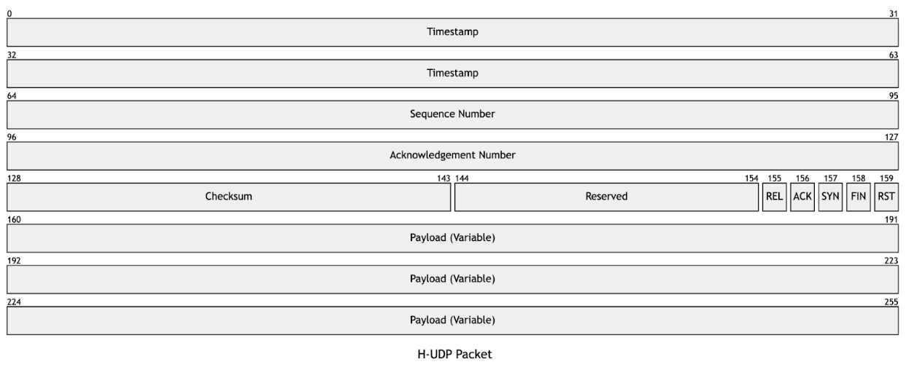
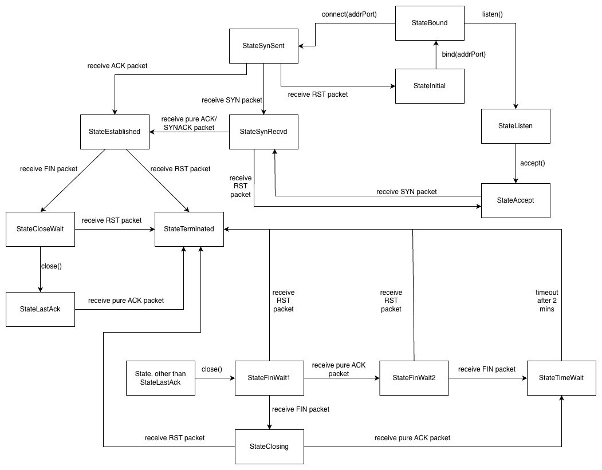

# CS3103 AY25/26 Assignment 4: GameNetAPI (Group 39)

## Project Overview
GameNetAPI is a custom transport layer protocol built over a single UDP socket to support two distinct logical channels: Reliable (for critical game state/commands) and Unreliable (for non-critical, time-sensitive data like position updates). This design is optimized for low-latency, real-time applications such as online gaming. GameNetAPI handles all connection management, packet construction, demultiplexing, and the Reliable Data Transfer (RDT) logic.


## Table of Content

- [1. Quick Start](#1-quick-start)
    - [1.1 Requirements](#11-requirements)
    - [1.2 Using the API directly](#12-using-the-api-directly)
    - [1.3 Testing the Program](#13-testing-the-program)
- [2. Design](#2-design)
    - [2.1 Overview](#21-overview)
    - [Dual-channel Architecture](#dual-channel-architecture)
    - [Specification Overview](#specification-overview)
    - [2.3 Hybrid UDP (H-UDP) Protocol and RDT Details](#23-hybrid-udp-h-udp-protocol-and-rdt-details)
        - [Packet Header Format](#packet-header-format)
        - [Control Flags (16 bits)](#control-flags-16-bits)
        - [Reliable Data Transfer (RDT) Details](#reliable-data-transfer-rdt-details)
- [3. Implementation](#3-implementation)
    - [3.1 Overviews of Files and Components](#31-overviews-of-files-and-components)
        - [`hudp.py`](#hudp.py)
        - [`gnscontext.py`](#gnscontext.py)
        - [`gns.py`](#gns.py)
        - [`api/states`](#apistates)
        - [`forwarder.py`](#forwarder.py)
        - [`client.py`, `server.py`](#client.py-server.py)
        - [`common.py`](#common.py)
    - [3.2 Detailed Information for Key Components](#32-detailed-information-for-key-components)
        - [3.2.1 H-UDP Packet Format (hudp.py)](#321-h-udp-packet-format-hudp.py)
        - [3.2.2 GameNetSocket API](#322-gamenetsocket-api)
        - [3.2.3 GNS Context](#323-gns-context)
        - [State machine overview](#state-machine-overview)


## 1. Quick Start
### 1.1 Requirements
- Python version **3.13.7**
- Linux machine (minimally with tc installed to run tests)
- Download the **zip file** and extract items.

### 1.2 Using the API directly
**Example:**
```python
from api.gns import GameNetSocket

sock = GameNetSocket()

# bind to your host and port number
sock.bind(("127.0.0.1", 12345))

# connect to another socket (must be binded and listening beforehand)
sock.connect(("127.0.0.1", 54321))

sock.send("hello".encode(), isReliable=True) # use True for reliable and False for unreliable

print(sock.recv().decode())

sock.close()
```

### 1.3 Testing the Program
**With Test Script**
1. In Linux terminal, run `./test.sh [u/r] [low_loss/high_loss]` to simulate real-world lossy network conditions.
    - **Parameters**
        - **u/r:** data sent over **unreliable/reliable** channel
        - **low_loss/high_loss:** packet loss rate
    - **Results:** Displayed at the end of packet transmissions.
2. To cleanup, run `./test.sh cleanup`

**With Manual Execution**
1. Start your network emulator (e.g., `tc netem`) or you may use the provided forwarder (small test helper) to simulate packet loss:

```bash
python3 forwarder.py
```

2. Start the server in a separate terminal:
```bash
python3 server.py
```

3. Start the client in another separate terminal:
```bash
python3 client.py
```

**Note:** Check `common.py` for the default port constants (`CLIENT_PORT`, `FORWARDER_PORT`, `SERVER_PORT`).

---------------------------------------------------------
## 2. Design
### 2.1 Overview
GameNetAPI provides two main channels: reliable and unreliable channels in one connection. It also mimics the implementation of TCP which is connection oriented, implementing 3-way handshake and 4-way termination. For reliable packets, reliability is ensured by implementing Go-Back-N with retransmission and in-order delivery through packet reordering and skip timeout.

#### Dual-channel Architecture
| Reliable Channel | Unreliable Channel | 
| ---------- | ------------ | 
| **Guaranteed delivery** with retransmission, **quick timeout set at 20ms** | **Best-effort delivery**, no retransmission |
| **In-order delivery** using **Go-Back-N**. Window-based flow control to manage transmission rate and out-of-order packet buffering. | Lower latency |
| **ACK required** for each packet, **timeout mechanism set at 200ms** | No ACK required |

#### Specification Overview
| Feature | Value | 
| ---------- | ------------ | 
| Header Size | 20B |
| Max Retries for reliable packet | 15 |
| Max Retries for unreliable packet | 1 |
| ACK Timeout | 200ms |
| Retranmission Timeout | 20ms |
| Socket Timeout | 200ms |
| Reliable Data Transmission Method | Go-Back-N |
| Packet Ordering | Window buffering |
| Max Window Size | 4096 Packets |
| Max Buffer Size | 4096 Packets |

**The data flows works as follows:**
1. Client will create a GameNetSocket and send data.
2. The forwarder (Network) will receive the packets and forward the packets. 
3. Next, the server will receive the packets through GameNetSocket. 
4. Same path in reverse for server-client communication.

### 2.3 Hybrid UDP (H-UDP) Protocol and RDT Details
**Packet Header Format**
All H-UDP packets share a **20-byte header**:

| Field Name | Size (Bytes) | Description |
| ---------- | ------------ | ----------- |
| Timestamp | 8 | Time in milliseconds when the packet was created. |
| SeqNo | 4 | Packet sequence number (for unreliable channel, the seqno is always -1) |
| AckNo | 4 | Packet ACK number (for reliable channel) |
| Checksum | 2 | 1's complement checksum of the header with checksum field set to 0 |
| Packet flags | 2 | (See below) |
| Payload | Variable | Application data |

**Control Flags (16 bits)**
| Flags | Size (bits) | Descriptions |
| ---------- | ------------ | ----------- |
| Reserved | 11 | Reserved for future use |
| REL | 1 | 1 for reliable packets, 0 for unreliable packets |
| ACK | 1 | 1 if the acknowledgement number is significant. 0 otherwise |
| SYN | 1 | 1 = Synchronize sequence numbers. (Connection establishment) |
| FIN | 1 | 1  = No more data from the sender. (Connection Termination) |
| RST | 1 | 1 = Reset Connection. |

**Reliable Data Transfer (RDT) Details**
Reliable Channel Logic
- Algorithm: Go-Back-N.
- Retransmission: Packets are retransmitted if no ACK is received within 20 ms.
- In-Order Delivery & Skip Timeout: The receiver buffers and reorders reliable packets. If the Head-of-Line (HOL) packet is lost and the wait time exceeds 200 ms threashold, the missing packet is skipped to prevent indefinite HOL blocking, allowing subsequent in-order packets to be delivered.

## 3. Implementation
### 3.1 Overviews of Files and Components
##### **`hudp.py`**: Packet layouts, flags, and checksums.
- Implements HUDP packet structure
- Provides HUDPFlags and HUDPPacket classes with helpers such as `create`, `createPureAck`, `toBytes/fromBytes`, and `checksum` and etc.

##### **`gnscontext.py`**: Maintain state information for a GNS connection.
- Maintains connection states, sequence numbers, buffers, and timers for both reliable and unreliable channels.

##### **`gns.py`**: Provide public socket with TCP-like (bind/connect/listen/accept/send/recv/close).
- Exposes the public socket-like API:
    - `__recv`: receives UDP datagrams, verifies checksums, and places packets into recvWindow.
    - `__send`: moves packets from sendBuffer to sendWindow and performs UDP sends; tracks retries.
    - `__routine`: runs the FSM (state.process(context)) repeatedly and emits ACKs as needed.
- Methods: `bind`, `listen`, `accept`, `connect`, `send(data, isReliable)`, `recv(timeout)`, `close`.

##### **`api/states`**: Different connection states.
- Implements FSM states for connection management.
- Each state has a `process(context)` method to handle incoming packets and manage state transitions.
- `gnssestablished.py` implements in-order delivery, out-of-order buffering, pure ACK handling, FIN/RST handling, and an ACK-timeout skip to avoid stalls.

##### **`forwarder.py`**: Simple network emulator to simulate packet transmission for simple test.
- Receives UDP datagrams and forwards or drops them to simulate loss and disorder.
- Loss rate and disorder rate can be configured.

##### **`client.py`, `server.py`**: Sample applications.
- Sample applications demonstrating the use of GameNetAPI for client-server communication.

##### **`common.py`**: Provides constants and timeout values.
- Contains constants such as port numbers and timeout durations used across the project.

### 3.2 Detailed Information for Key Components
#### 3.2.1 H-UDP Packet Format (hudp.py)

- `HUDPPacket` class represents the H-UDP packet structure and provides methods for creating packets, converting to/from bytes, and calculating checksums.
- H-UDP packets carry a 20-byte header followed by payload bytes.
- The checksum is computed using 1's complement over the full packet bytes (header + payload) with the checksum field set to zero during calculation.
- `HUDPFlags` class defines the control flags used in the H-UDP protocol.
    - Flag helpers (isSyn, isSynAck, isPureAck, isFin, isRst) used to detect control packets.


#### 3.2.2 GameNetSocket API
- `GameNetSocket` class provides a socket-like API for applications to use.

**Key methods:**
- `bind(addrPort)` 
    - Bind this socket to a specific address and port number. 
    - Must be **called before connect()** due to UDP source-port behavior.

- `listen()` 
    - Begin listening on connection requests. The socket must be bound before this.
    - Starts the recv thread.

- `accept()` 
    - Begin accepting the connection requests. The socket must be listened on before this.
    - Return after connection with a remote is established.

- `connect(addrPort)`
    - Connect to a remote GameNetSocket at addrPort. 
    - The socket **must be bound** before this as UDP `sendto()` function may send from **different ports** across **different calls** which will cause unexpected behavior for reliable transmission.
    - Transitions to the connect path and starts the routine/send threads.
    - Blocks until the 3-way handshake completes.

- `send(data: bytes, isReliable: bool)`
    - Send data to remote. 
    - A **connection must be established** before this.

- `recv(timeout=1.0)`
    -  Return data sent from remote.
    -  This function will block until there is data to receive.
    - A **connection must be established** before this.

- `close()`
    - Close the connection. 
    - Close by sending FIN and transitioning through termination states.
    - Blocks until final close completes.
    - A **connection must be established** before this.

Example Usage as a Client:
```python
from api.gns import GameNetSocket

sock = GameNetSocket()
sock.bind(("127.0.0.1", 12345))
sock.connect(("127.0.0.1", 54321))
sock.send("hello".encode(), isReliable=True)
data = sock.recv()
sock.close()
```

#### 3.2.3 GNS Context
GNSContext is the core statemanagement class that maintains the state of a GameNetSocket connection.

**Key Components:**
- `sendWindow`: 
    - Queue to store ready-to-send packets. 
    - Timeout is 0.200s.
- `sendBuffer`:
    - A queue of packets that have been sent but not yet acknowledged.
    - GameNetSocket has a routine to check when packets times out and put them into `sendWindow`.
- `recvWindow`: 
    - A queue of received packets for reordering buffer for received packets.
    - Ordered from packets with **lowest to highest** sequence numbers.
- `shouldSendAck`: 
    - A flag to indicate if an ACK should be sent.
    - Whether a data packet was received.
    - Important to note especially if the data packet received was out-of-order.

**State machine overview:**

- The FSM is implemented as multiple state classes under `api/states/`.
- Each state class has a `process(context)` method that handles incoming packets and manages state transitions.
